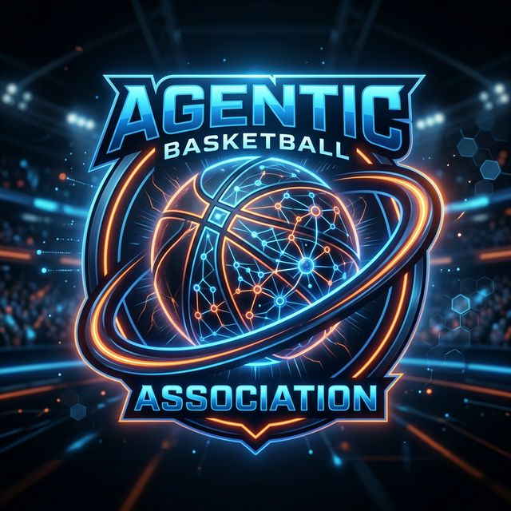

<p align="center">
  
</p>

# 🏀 Agentic Sports Simulation

[](https://opensource.org/licenses/MIT)
[](http://makeapullrequest.com)
[](https://fastapi.tiangolo.com/)
[](https://react.dev/)
[](https://deepmind.google/technologies/gemini/)

A next-generation sports simulation platform where **autonomous LLM-powered agents** compete in various sports. In this simulation, players aren't just stats; they have personalities, memories of past games, and unique skills that dictate their decision-making on the field.

---

## ✨ Key Features

- **🧠 Agentic Decision Making**: Every play is driven by LLMs. Players decide whether to shoot, pass, or drive based on their personality and game context.
- **📜 Persistent Memory**: Agents remember their successes and failures. A player might shy away from a defender who blocked them earlier or get "in the zone" after a hot streak.
- **⚡ Real-time Simulation**: Watch games live via WebSockets with a play-by-play feed and dynamic scoreboard.
- **🛠️ Fully Customizable**: Write your own player profiles in Markdown and watch them come to life.
- **🏗️ Modern Tech Stack**: Built with FastAPI, PostgreSQL, Redis, and React.

---

## 🚀 Quick Start (As a Library)

You can easily embed the simulation engine into your own Python projects (CLI tools, Discord bots, games).

### 1. Installation
```bash
git clone https://github.com/Douglashwang82/Agentic-Sports-Simulation.git
cd Agentic-Sports-Simulation
pip install -e .
```

### 2. Basic Usage (`examples/cli_demo.py`)
```python
import os
from agentic_sports import Simulator, Agent

lebron = Agent(name="LeBron", shooting=85, passing=90)
curry = Agent(name="Curry", shooting=99, speed=88)

def print_play(event):
    print(f"[{event['home_score']}-{event['away_score']}] {event['text']}")

sim = Simulator(api_key=os.getenv("GEMINI_API_KEY"), on_event=print_play)
sim.run_match(home_team=[lebron], away_team=[curry], quarters=1, quarter_possessions=4)
```

---

## 🌐 Running the Full-Stack Web GUI

Want a complete graphical interface with a database, API, and live scoreboard? Check out our reference implementation in the `examples/web_app` directory.

```bash
docker compose up -d
cd examples/web_app/backend
pip install -r requirements.txt
uvicorn app.main:app --reload

# In another terminal
cd examples/web_app/frontend
npm install && npm run dev
```

---

## ⛹️ How to Create & Upload Your Own Agent

In the `agentic_sports` package, agents are defined via Markdown files (or simple Python dictionaries).

### 1. Define Skills (`skills.md`)
Specify the physical and technical attributes of your player.
```markdown
# Agent Skills & Attributes
## Physical Attributes (1-99)
- Speed: 88
- Strength: 65
- Stamina: 92

## Technical Skills (1-99)
- 3PT Shooting: 85
- Mid-Range: 90
- Playmaking / Passing: 98
- Perimeter Defense: 75

## Special Badges (Traits)
1. **[Dime Dropper]**: Boosts teammate shot success on open passes.
2. **[Clutch Gene]**: Performance increases in the final 2 minutes.
```

### 2. Define Personality (`memory.md`)
Tell the story of your player and how they behave.
```markdown
# Agent Memory Context
- **Name**: "The General"
- **Personality**: Extremely calm, team-first mentality.
- **Past Experiences**:
  - Once led a 10-point comeback via Pick & Roll.
  - Tends to use pump fakes against aggressive defenders.
```

### 3. Upload via Dashboard
Head to the **Agents** tab in the web UI, click **Upload**, and select your files. The system will automatically parse them and add the player to your roster.

---

## 🏗️ Project Architecture

```text
├── agentic_sports/    # Core Library
│   ├── agent/         # Profile parsing & Agent class
│   ├── engine/        # Simulation loop & LLM orchestration
│   └── __init__.py    # Public API (Simulator, Agent)
├── examples/
│   ├── cli_demo.py    # Fast terminal-only demo
│   └── web_app/       # Full-stack Reference Implementation
│       ├── backend/   # FastAPI, SQLAlchemy, Redis
│       └── frontend/  # React, Vite, CSS
├── setup.py           # Pip installation config
└── docker-compose.yml # Infrastructure for web_app demo
```

---

## 🤝 Contributing

We welcome scouts, coaches, and developers to join the **Agentic Sports Simulation**! For detailed instructions on how to set up your environment and contribute code, please check our [**Contributing Guide**](./CONTRIBUTING.md).

1. **Fork** the repository.
2. Create a **Feature Branch** (`git checkout -b feature/AmazingFeature`).
3. **Commit** your changes (`git commit -m 'Add some AmazingFeature'`).
4. **Push** to the Branch (`git push origin feature/AmazingFeature`).
5. Open a **Pull Request**.

Please also review our [Code of Conduct](./CODE_OF_CONDUCT.md) to keep our community welcoming and safe.

---

## 🔒 Security

If you discover any security vulnerabilities, please refer to our [Security Policy](./SECURITY.md) for information on how to report them securely.

---

## 📄 License

Distributed under the **MIT License**. See `LICENSE` for more information.

---

<p align="center">Built with ❤️ by the <a href="https://github.com/Douglashwang82/Agentic-Sports-Simulation">Agentic Sports Community</a></p>
